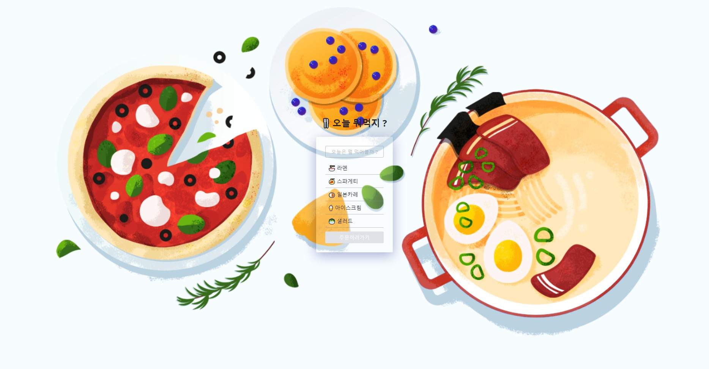
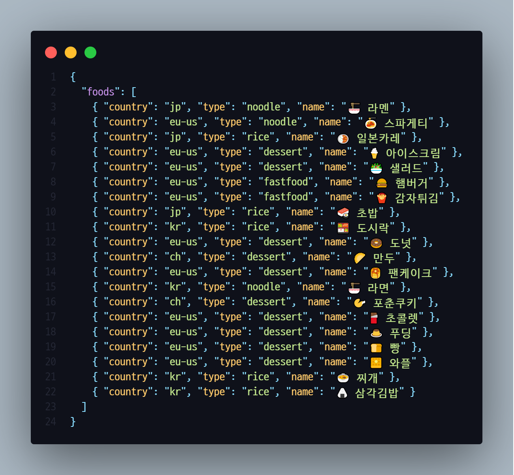
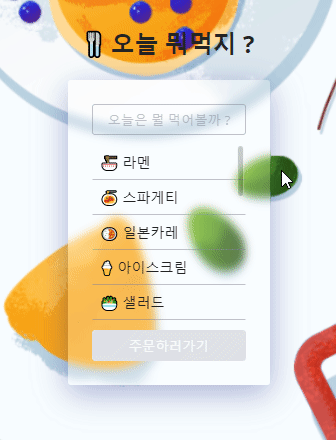

# Project-Menu



[프로젝트 구경가기](https://baegofda.github.io/Project-Menu/)

## **✨ 목표**

- HTML, CSS, JAVSCRIPT를 사용하여 간단한 Application 만들기
- jQuery와 같은 라이브러리는 사용하지않고 기능 구현하기
- 데이터는 JSON으로 받고 Fetch API로 불러오기
<p align="center"></p>

## **🧰 사용기술**

- HTML, CSS ,JAVSCRIPT

## **📅 소요기간**

- 1일

## **👀 주요기능 & 코드**

```
💡 주요기능

1. 카테고리별 메뉴 분류
2. 메뉴 선택 후 주문버튼 활성화
```

### **1. 카테고리 선택 버튼을 클릭하면 카테고리 목록이 나온다.**

<p align="center"></p>

### **💻 코드살펴보기**

> 페이지 로드시 data.json 파일의 데이터를 불러옵니다.
> 카테고리별 메뉴를 볼 수 있습니다.

```js
function loadData() {
  return fetch("data/data.json")
    .then((res) => res.json())
    .then((json) => json.foods)
    .catch((err) => console.log(err));
}

const dropdown = document.querySelector(".dropdown");
const categoryContainer = document.querySelector(".select__categories");
const submitBtn = document.querySelector(".select__order-btn");
const toggleBtn = document.querySelector(".select__dropdown");

dropdown.addEventListener("mousedown", (e) => {
  const target = e.target;
  if (target.classList.contains("select__dropdown")) {
    categoryHandler();
  } else if (target.className === "select__btn") {
    categoryHandler();
    selectCategory(target);
    submitBtn.setAttribute("disabled", "disabled");
  }
  return;
});

// 카테고리 목록 보이기
function categoryHandler() {
  categoryContainer.classList.toggle("show");
}

//함수실행
loadData()
  .then((items) => {
    //받은 json타입의 데이터를 리스트를 뿌리기 위함
    displayItems(items);
    setEventListeners(items);
  })
  .catch((err) => console.log(err));
```

### **2. 버튼을 클릭하거나 다른 화면을 클릭시 메뉴가 닫힌다.**

<p align="center"></p>

### **3. 카테고리를 선택하면 메뉴의 필터링이 가능하다.**

<p align="center"></p>

### **4. 메뉴를 선택하면 선택과 함께 주문 버튼이 활성화가 된다.**

<p align="center"></p>

```js
//메뉴 선택시 주문버튼 활성화
menuList.addEventListener("click", (e) => {
  const target = e.target;
  target.classList.toggle("selected");
  submitBtn.removeAttribute("disabled");
});
```

## **👋 마무리 소감**

> 기초 숙련을 위해 만든 간단한 Application 이지만 처음 겪는 문제에 봉착하여 당황을 했었다.<br><br>
> 기능 2번의 카테고리 목록을 닫을때 blur와 click 이벤트의 문제로 정상적으로 작동하지 않았었다.  
> 구글링을 통해 해결 할 수 있었는데 blur와 click 이벤트간의 순서로 문제가 생길 수 있다는것을 처음알았고 click 이벤트를 mousedown으로 변경하여 문제를 해결하였다.
> [참고링크](https://p-iknow.netlify.app/front-end/mouse-blur-event-order)<br><br>
> 이제 걸음을 시작한 단계이기 때문에 하나하나의 에러가 나를 성장하게 해주는것 같기에 더더욱 많은 경험을 위해 프로젝트를 만들어봐야겠다.
